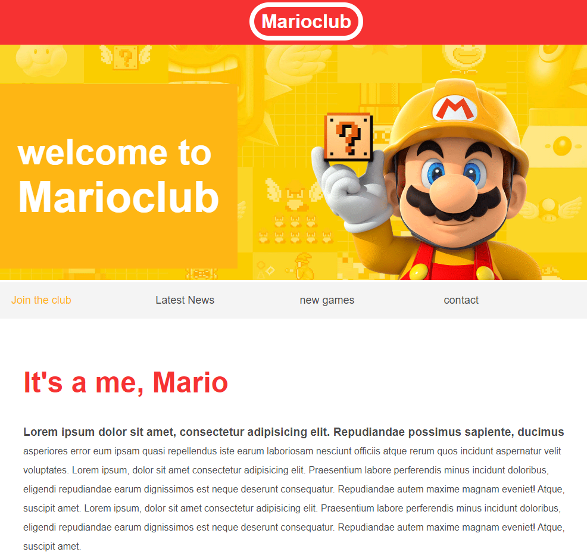

# HTML and CSS Responsive Web Design

This repository contains HTML and CSS code for a responsive web design.

# Preview of marioclub



## Description

The project includes the following features:

- Responsive web design that adjusts to different screen sizes.
- HTML for structuring the web content.
- CSS for styling the web content.

## How to Use

1. Clone this repository:
   ```bash
   git clone https://github.com/CHETHAN-m-727/HTML-and-CSS.git
   ```
